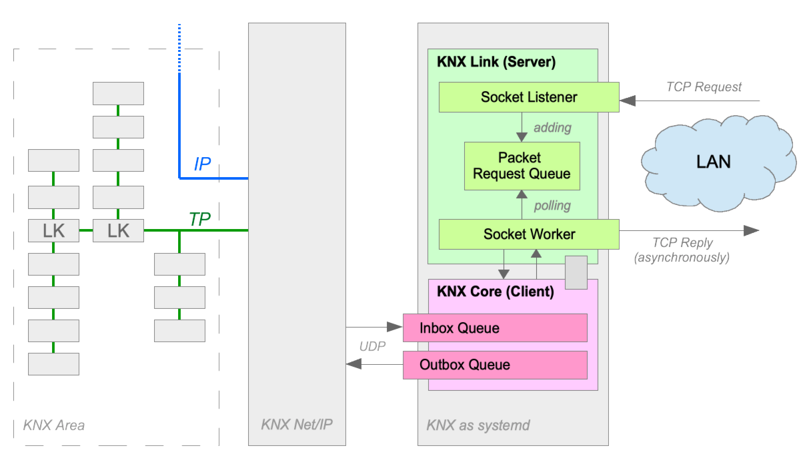

[](https://github.com/pitschr/knx-link/actions/workflows/build-knx-server.yml)
[](https://coveralls.io/github/pitschr/knx-link?branch=main)
[](https://www.gnu.org/licenses/gpl-3.0)

# KNX Link

The KNX Link establish a connection to your KNX Net/IP device using the [knx-core](https://github.com/pitschr/knx-core) 
library and acts as a KNX gateway. The KNX Link project is based on two components: **KNX Link Server** and 
**KNX Link Client**.

The purpose of the *KNX Link Server* is to serve the requests from *KNX Link Client* and communicates
with the KNX Net/IP device with almost no delay. This is achieved by avoiding establishing a connection
to the KNX Net/IP device as a long-running `systemd` service and keeps the connection established. In 
this way we can avoid spending up to few seconds per connection ramp ups and tear downs.

The *KNX Link Client* is a lightweight commandline tool with a short life-cycle and comes with a much 
simplified protocol which has been designed for communication between the *KNX Link Server* and the
*KNX Link Client*. The communication between those parties are done via TCP socket as illustrated below.



## Prerequisites

* **Host**
    * A dedicated machine based on Linux (e.g. CentOS)
    * [curl](https://man7.org/linux/man-pages/man1/curl.1.html) for downloading the files for installation
    * [systemctl](https://man7.org/linux/man-pages/man1/systemctl.1.html) for setup for systemd service
* **Java 11+**
    * Make sure that you have Java 11+ installed and running as Java 11+

## KNX Link Server

#### How to install KNX Link Server?

Execute and follow the instructions:
```
bash <(curl -s https://raw.githubusercontent.com/pitschr/knx-link/main/install.sh)
```

What it is doing? It is downloading the file [install.sh](./install.sh) I prepared for you and will prompt
guide you through the installation and asking some questions which you may reply with 'yes' or 'no'. 

In nutshell, the steps of [install.sh](./install.sh) script are:
1. Creating a technical user `knx` for systemd service
1. Downloading the `knx-link-<version>.jar` file to folder `/opt/knx-link-<version>`
1. Install `knx.service` to start and keep KNX Link server running (e.g. after reboot)
1. (Optional) Create a `knx` firewall rule for your `firewalld`, which opens the UDP port `3671` which is 
   registered for KNX communication. Opens UDP ports `40001` (for Description Channel), `40002` 
   (for Control Channel) and `40003` (for Data Channel) which are required for communication without NAT.
1. Check if the systemd service is running 
1. (Optional) Check if the port of KNX Link server is open

#### How to start, stop or restart KNX Link Server?

After installation, the *KNX Link Server* is installed as a fully managed service by the `systemd` daemon 
and executed as technical user (`knx`). It is a long-running process and in normal reasons there is no 
need to start or stop it by yourself. However, in special cases you need to start/stop/restart the 
*KNX Link Server*; i.e. when you change the server configuration file (`server.cfg`, see below) and apply 
the change immediately.

| Action      | Command |
| ----------- | -------------------------------------- |
| **Start**   | `systemctl start knx.service`          |
| **Stop**    | `systemctl stop knx.service`           |
| **Restart** | `systemctl restart knx.service`        |

For further info, please check out the [systemctl man page](https://man7.org/linux/man-pages/man1/systemctl.1.html).

#### KNX Link Server Configuration

The configuration for KNX Link server is `server.cfg` and in folder `/opt/knx-link-<version>/server.cfg`. 

By default, no `server.cfg` file exists which means the KNX Link Server will use default values. 
This is suitable for many cases, however, if a different configuration is required, then please 
go to folder `/opt/knx-link-<version>/server.cfg` and create a file `server.cfg` and apply the 
config key and values according your needs. 

| Config Key                 | Default&nbsp;Value                 | Description |
| -------------------------- | ---------------------------------- | ----------- |
| `knx.mode`                 | `tunneling`                        | Defines the mode of communication how the KNX Link server should communicate with the KNX Net/IP device.<br><br>**Allowed values:**<br>`tunneling` or `routing` |
| `knx.nat`                  | `false`                            | Defines if the Network Address Translation (NAT) should be used. NAT is can be used for `tunneling` mode only. If `routing` mode is used then it has no effect and is ignored.<br><br>**Allowed values:**<br>`false` or `true` |
| `knx.address`              | `0.0.0.0`<br>(Auto&nbsp;Discovery) | If your KNX Net/IP device has a static IP address you can set the IP address that allows a faster start-up as it will skip the auto-discovery process. This setting might be also useful if you have more than one KNX Net/IP device and you want to specific one, otherwise the auto-discovery will choose a KNX Net/IP device in behalf of you otherwise.<br><br>**Allowed Pattern:**<br>`[0-255].[0-255].[0-255].[0-255]` | 
| `knx.port`                 | `3671`                             | Set only if your KNX Net/IP device is using a port number that differs from the officially registered KNX port `3671` at IANA.<br>If 'knx.address' is 'auto', then KNX port has no effect and will be ignored.<br><br>**Allowed Port Range:**<br>`1024 - 65535` | 
| `server.port`              | `3672`                             | Set only if you want to use a different port for your KNX Link server that opens a server socket channel for your clients. This is not the port communicating with your KNX Net/IP device.<br><br>**Allowed Port Range:**<br>`1024 - 65535` |
| `server.allowed.addresses` | `127.0.0.1`<br>(localhost)         | This setting is used to accept requests from your clients that are from a trusted IP address. Default is `127.0.0.1` which means it will only accept requests which are originated from the same machine. Localhost (`127.0.0.1`) is always accepted, therefore you do not need to whitelist the localhost. You can define multiple IP addresses which should be accepted as well; define them as comma-separated. Example: `10.0.1.2,192.168.1.4,192.168.2.8`.<br><br>**Allowed Pattern:**<br>`[0-255].[0-255].[0-255].[0-255]` |


## How to install the KNX Link Client?

*Precondition to use the KNX Link Client is that KNX Link Server is running. Therefore, this section assumes that you already
have KNX Link Server installed and running.*

The KNX Link Client is implemented in [Rust](https://www.rust-lang.org/) to allow a very quick cold-start 
and communication with the KNX Link Server. The biggest advantage is that no runtime (e.g. Java JDK) is 
required which runs the application natively. The pre-build executables can be found on the
[release page](https://github.com/pitschr/knx-link/releases). Just download it and save it as `knx-link-client` 
and make sure that the file is executable.

Reminder: If you are requesting the KNX Link Server from another machine, please make sure that the IP address of the
machine list is white-listed on the KNX Link Server, otherwise your packets won't be accepted by the KNX Link Server
for security reasons. See `server.allowed.addresses` setting of KNX Link Server.

The KNX Link Client has following parameters which are globally available for all sub-commands. Each sub-command
 have their own parameters.

| Parameter                 | Default&nbsp;Value                 | Description |
| ------------------------- | ---------------------------------- | ----------- |
| `-h`<br>`--host`          | `127.0.0.1` (localhost)            | The IP Address where the KNX Link Server is running |
| `-p`<br>`--port`          | `3672`                             | The port of the KNX Link Server is listening |

### Read Sub-Command

The **read** sub-command to send a **read request** packet to KNX Link Server

| Parameter                     | Description |
| ----------------------------- | ----------- |
| `-g`<br>`--group_address`     | The KNX group address that should receive the read request.<br><br>Supported formats are<br>**Three-Level:** Main, Middle and Sub (Range: `0/0/1 - 31/7/255`),<br>**Two-Level:** Main and Sub (Range: `0/1 - 31/2047`) and<br>**Free-Level:** Address (Range: `1 - 65535`) |
| `-d`<br>`--data_point_type`   | The KNX data point type that you are requesting for.<br><br>Supported formats are `#`, `#.#`, `dpt-#` and `dpst-#-#`.<br>**Examples for 'Switch' Data Point Type:**<br>`1`, `1.1`, `1.001`, `dpt-1`, `dpst-1-1`<br>**Examples for 'Date' Data Point Type:**<br>`11`, `11.1`, `11.001`, `dpt-11`, `dpst-11-1` |

Given examples requests the KNX Group Address `1/2/113` (which has a READ-Flag) the status of e.g. lamp. With given
data point type `1.001` we may either get `On` or `Off`.

```
knx-link-client read -g 1/2/113 -d 1.001
```

### Write Sub-Command

The **write** sub-command to send a **write request** packet to KNX Link Server

| Parameter                     | Description |
| ----------------------------- | ----------- |
| `-g`<br>`--group_address`     | The KNX group address that should receive the read request.<br><br>Supported formats are<br>**Three-Level:** Main, Middle and Sub (Range: `0/0/1 - 31/7/255`),<br>**Two-Level:** Main and Sub (Range: `0/1 - 31/2047`) and<br>**Free-Level:** Address (Range: `1 - 65535`) |
| `-d`<br>`--data_point_type`   | The KNX data point type that you are requesting for.<br><br>Supported formats are `#`, `#.#`, `dpt-#` and `dpst-#-#`.<br>**Examples for 'Switch' Data Point Type:** `1`, `1.1`, `1.001`, `dpt-1`, `dpst-1-1`<br>**Examples for 'Date' Data Point Type:** `11`, `11.1`, `11.001`, `dpt-11`, `dpst-11-1` |
| `-v`<br>`--value`             | The value you want to send to KNX Link Server.<br><br>The supported formats depends on the data point type you selected<br>**Examples for DPT-1:** `on`, `off`, `true`, `false`, `1`, `0`<br>**Examples for DPT-3:** `stop`, `"controlled stop"`<br>**Examples for DPT-5:**  `1`, `10`, `20`<br>**Examples for DPT-9:** `1.23`, `123.456`<br>**Examples for DPT-10:** `00:00:00`, `12:34:56`<br>**Examples for DPT-11:** `2000-01-02`, `2050-03-04`<br>**Examples for DPT-13:** `1234`, `-1234`<br>**Examples for DPT-16:** `"Hello World"`<br> |

The example sets the lamp to `On` for given KNX Group Address `1/2/100`. Based on the data point type `1.001`
which stands for *Switch* which is a boolean representation the KNX know that `on` is meant to switch on the 
lamp. Alternatively to `on` you can use the `true` or `1` to switch on the lamp.
```
knx-link-client write -g 1/2/110 -d 1.001 -v on
```