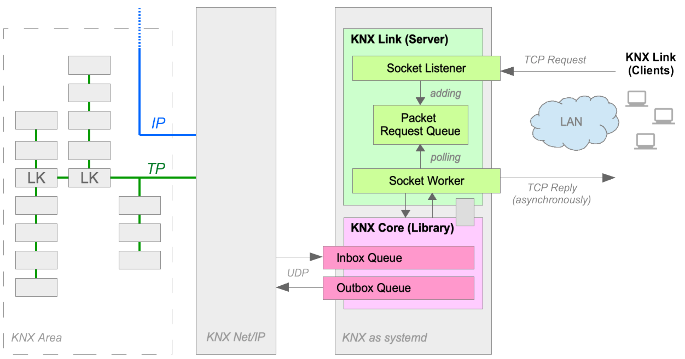

This git repo has been splitted into several git repositories (see below). This space will be reserved for planned project to provide a native CLI tool that communicates with KNX Core as daemon.


### [KNX Core](https://github.com/pitschr/knx-core)
KNX Core - A Java library for KNX Net/IP communication

### [KNX Core Plugins](https://github.com/pitschr/knx-core-plugins)
Plugins for KNX Core library to extend the core functionality with e.g. audit, statistic, REST API, ...

### [KNX Logic](https://github.com/pitschr/knx-logic) (Not Production Ready)
KNX Logic - A Java library for KNX for logic specific interactions

### [KNX Logic Components](https://github.com/pitschr/knx-logic-components) (Not Production Ready)
Logic components for _KNX Logic_ engine

### [KNX Logic Testsuite](https://github.com/pitschr/knx-logic-testsuite) (Not Production Ready)
Test suite for _KNX Logic_ and _KNX Logic Components_

### [KNX Demo: KNX Monitor for TTY / Terminal](https://github.com/pitschr/knx-demo-tty-monitor)
A demo application for KNX Core. Available as a container image (docker, podman).

----

[](https://github.com/pitschr/knx-link/actions)
[](https://coveralls.io/github/pitschr/knx-link?branch=main)
[](https://www.gnu.org/licenses/gpl-3.0)

# KNX Link

The KNX Link establish a connection to your KNX Net/IP device using the [knx-core](https://github.com/pitschr/knx-core) 
and acts as a KNX gateway. KNX Link comes with a pair: **server** and **client**.

The purpose of the KNX Link server and client is to allow you to send requests to KNX network with almost 
no delay. The *KNX Link server* is running as a long-running `systemd` service and keeps the connection 
with your KNX Net/IP device and is taking care of the heavy communication tasks while the *KNX Link client* 
is a light-weight command-line tool with a short life cycle. The communication between the server and client
is done via TCP socket as illustrated below.



### Prerequisites

* **Host**
    * A dedicated machine based on Linux (e.g. CentOS)
    * [curl](https://man7.org/linux/man-pages/man1/curl.1.html) for downloading the files for installation
    * [systemctl](https://man7.org/linux/man-pages/man1/systemctl.1.html) for setup for systemd service
* **Java 11+**
    * Make sure that you have Java 11+ installed and running as Java 11+

## How to install?

Execute and follow the instructions:
```
bash <(curl -s https://raw.githubusercontent.com/pitschr/knx-link/main-initial-commit/install.sh)
```

What it is doing? It is downloading the file [install.sh](./install.sh) I prepared for you and will prompt
some questions where you have to reply with 'yes' or 'no'. For example, it will ask if the KNX Link should 
be installed as a systemd service. Optionally, if you are using a `firewalld` (`firewall-cmd`) then it will 
also ask if a firewall rule should be configured; here it will open the UDP port `3671` which is registered
for KNX communication.

In nutshell, the steps of [install.sh](./install.sh) script are:
1. Creating a technical user `knx` for systemd service
1. Downloading the `knx-link-<version>.jar` file to `/opt/knx-link-<version>`
1. Install `knx.service` to start and keep KNX Link server running (e.g. after reboot)
1. (Optional) Create a `knx` firewall rule for your `firewalld`
1. Check if the systemd service is running 
1. Check if the port of KNX Link server is open

## How to run the client (after installation of KNX Link server)?

Next step is to download and install a client that sends requests to your KNX Link server 
which acts like as a gateway to your KNX network.

## KNX Link Configuration

The configuration for KNX Link server can be found at the path: `/opt/knx-link-<version>/server.cfg`

| Config Key                 | Default&nbsp;Value | Description |
| -------------------------- | ------------- | ----------- |
| `knx.mode`                 | `tunneling` | Defines the mode of communication how the KNX Link server should communicate with the KNX Net/IP device.<br><br>**Allowed values:**<br>`tunneling` or `routing` |
| `knx.nat`                  | `false` | Defines if the Network Address Translation (NAT) should be used. NAT is can be used for `tunneling` mode only. If `routing` mode is used then it has no effect and is ignored.<br><br>**Allowed values:**<br>`false` or `true` |
| `knx.address`              | `0.0.0.0`<br>(Auto&nbsp;Discovery) | If your KNX Net/IP device has a static IP address you can set the IP address that allows a faster start-up as it will skip the auto-discovery process. This setting might be also useful if you have more than one KNX Net/IP device and you want to specific one, otherwise the auto-discovery will choose a KNX Net/IP device in behalf of you otherwise.<br><br>**Allowed Pattern:**<br>`[0-255].[0-255].[0-255].[0-255]` | 
| `knx.port`                 | `3671` | Set only if your KNX Net/IP device is using a port number that differs from the officially registered KNX port `3671` at IANA.<br>If 'knx.address' is 'auto', then KNX port has no effect and will be ignored.<br><br>**Allowed Port Range:**<br>`1024 - 65535` | 
| `server.port`              | `3672` | Set only if you want to use a different port for your KNX Link server that opens a server socket channel for your clients. This is not the port communicating with your KNX Net/IP device.<br><br>**Allowed Port Range:**<br>`1024 - 65535` |
| `server.allowed.addresses` | `127.0.0.1`<br>(localhost) | This setting is used to accept requests from your clients that are from a trusted IP address. Default is `127.0.0.1` which means it will only accept requests which are originated from the same machine. You can define multiple IP addresses, define them comma-separated. Example: `10.0.1.2,192.168.1.4,192.168.2.8`.<br><br>**Allowed Pattern:**<br>`[0-255].[0-255].[0-255].[0-255]` |
